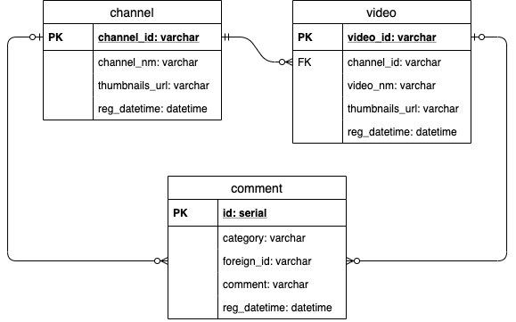

# Jack Project
## アプリ一覧

|名前|本番環境|リポジトリ|さくせん|進捗|
|--|--|--|--|--|
|Django Jack|[ここ](https://django-jack.herokuapp.com/)|[ここ](https://github.com/mtsml/django-jack)|ガンガンいこうぜ|■■■■■|
|Laravel Jack|[ここ](https://laravel-jack.herokuapp.com/)|[ここ](https://github.com/mtsml/laravel-jack)|バッチリがんばれ|■|
|Vue Jack|[ここ](https://vue-jack.herokuapp.com/)|[ここ](https://github.com/mtsml/view-jack)|ガンガンいこうぜ|■|
|Bash Jack|[ここ](http://hoge.hagetaka.art/index)|[ここ](https://github.com/mtsml/bash-jack)|フレームワークつかうな|■|
|Angular Jack|[ここ](https://angular-jack.herokuapp.com/)|[ここ](https://github.com/mtsml/angular-jack)|ガンガンいこうぜ|■|

Markdownで進捗の良い表し方あるかな？

## データ構造
### ER図


### エンティティ一覧
#### channel
Youtubeのチャンネル情報を管理する。

「Youtube API」に日毎のリクエスト制限が存在するため、チャンネル情報はアプリケーションで動的に取得せずに、属性として保持している。

|物理名|型|主キー|必須|説明|
|--|--|--|--|--|
|channel_id|varchar|1|Yes|チャンネルID|
|channel_nm|varchar||Yes|テーブル**追加時**のチャンネル名|
|thumbnails_url|varchar||Yes|テーブル**追加時**のサムネイルURL|
|reg_datetime|timestamp|||チャンネル追加日時|

#### video
Youtubeの動画情報を管理する。

「Youtube API」に日毎のリクエスト制限が存在するため、動画情報はアプリケーションで動的に取得せずに、属性として保持している。

|物理名|型|主キー|必須|説明|
|--|--|--|--|--|
|video_id|varchar|1|Yes|動画ID|
|channel_id|varchar||Yes|動画が紐づくチャンネルID|
|video_nm|varchar||Yes|テーブル**追加時**の動画名|
|thumbnails_url|varchar||Yes|テーブル**追加時**のサムネイルURL|
|reg_datetime|timestamp|||動画追加日時|

#### comment
アプリケーションで作成されたコメントを管理する。

コメントはチャンネルまたは動画に作成することができるため、外部キーを設定することができない（テーブル分けるべき？）

|物理名|型|主キー|必須|説明|
|--|--|--|--|--|
|id|serial|1|Yes|シーケンス|
|category|varchar||Yes|コメントの種別 [```channel```, ```video```]|
|foreign_id|varchar||Yes|チャンネルIDまたは動画ID|
|comment|varchar||Yes|コメント|
|reg_datetime|timestamp|||コメント作成日時|
